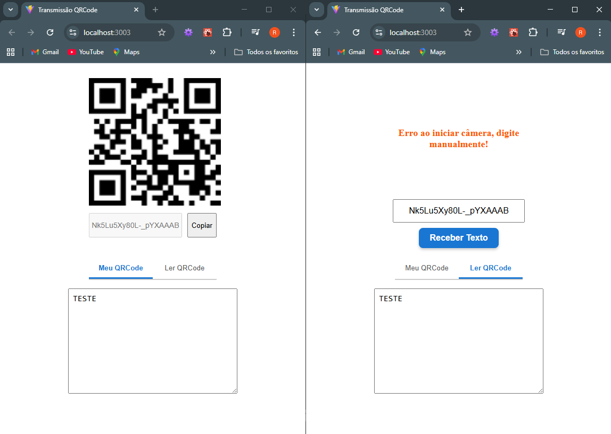

# Transmissão QR Code

## Introdução

### 🇧🇷 Português

Este projeto é um **aplicativo simples de mensageria** desenvolvido para demonstrar a **transmissão de dados por meio de QR Codes**.
Inicialmente, o dado transmitido é um **texto**, mas a arquitetura permite a extensão para estruturas **mais complexas**, como **listas**, **objetos JSON** ou **trechos de código**.

Devido à **limitação de tamanho dos QR Codes**, foi integrado um **sistema de comunicação via WebSocket**, possibilitando **transmissões client-to-client** e o **envio eficiente de mensagens longas**.

### 🌐 English

This project is a **simple messaging application** developed to demonstrate **data transmission using QR Codes**.
Initially, the transmitted data is **plain text**, but the architecture is designed to support **more complex structures**, such as **lists**, **JSON objects**, or **code snippets**.

Due to the **size limitations of QR Codes**, a **WebSocket communication system** was integrated, enabling **client-to-client transmission** and the **efficient delivery of long messages**.

### ⚠️ IMPORTANTE
O projeto funciona com https ou localhost, por conta de permissão de acesso a webcam e transmissão de dados com socket

**Recomendado:** usar `ngrok` ou `certificado autoassinado` para desenvolvimento

### ⚠️ IMPORTANT

The project only works over HTTPS or localhost due to webcam access permissions and socket data transmission requirements.

**Recommended:** use `ngrok` or a `self-signed certificate` for development.

---

## 🧠 Tecnologias e Abordagem

- **Gerador e Scanner QRCode**: Implementa bibliotecas para gerar e escanear qrcode de forma dinâmica.
- **WebSocket**: Comunicação bidirecional em tempo real.

## 🧠 Technologies and Approach

* **QR Code Generator and Scanner**: Implements libraries to dynamically generate and scan QR Codes.
* **WebSocket**: Enables **real-time**, **bidirectional communication** between clients and the server.

---

## 🚀 Principais pontos do Projeto

- **Transmissão de dados grandes client to client**
- **Comunicação em tempo real**

## 🚀 Key Features of the Project

* **Large data transmission (client-to-client)**
* **Real-time communication**

---

## 🖥️ Client Side

O **frontend** da aplicação foi construído utilizando **ReactJS** e duas principais bibliotecas para gerar e escanear qrcode, **`qrcode.react`** e **`html5-qrcode`**. 

A lib **`qrcode.react`** é utilizada para **gerar um qrcode** com o **código que referencia o web socket** no qual o cliente está conectado.

Já a lib **`html5-qrcode`** é utilizada para **escanear qrcode**, além disso, essa biblioteca permite escanear **outros tipos de códigos**, como **código de barras**, etc.

## 🖥️ Client Side

The **frontend** of the application was built using **ReactJS** and two main libraries for generating and scanning QR Codes: **`qrcode.react`** and **`html5-qrcode`**.

The **`qrcode.react`** library is used to **generate a QR Code** that contains the **WebSocket reference code** corresponding to the client’s active connection.

The **`html5-qrcode`** library is used to **scan QR Codes** and also supports **other types of codes**, such as **barcodes**.

---

## Server Side

O **Backend** do projeto é utilizado para gerenciar a **comunicação client to client** do projeto, servindo como um **intermediário** entre os `eventos disparados` e gerenciando os `rooms` em que estão conectados. Nesse sentido, o **servidor recebe o evento de um cliente** e **dispara um evento para outro cliente**, visto que `Web Socket` se comporta de forma **bidirecional** **client to server** e **server to client**.

## 🖥️ Backend

The **backend** of the project is responsible for managing **client-to-client communication**, acting as an **intermediary** between the `emitted events` and the management of the connected ``rooms``. In this setup, the server **receives an event from one client** and **emits it to another**, since ``WebSocket`` operates in a **bidirectional** manner — both **client-to-server** and **server-to-client**.

---

## Web Socket

**WebSocket** é um **protocolo de comunicação bidirecional** que estabelece uma **conexão persistente** entre o servidor e o navegador. Diferente do modelo tradicional baseado em requisições HTTP, o WebSocket mantém o canal aberto após a conexão inicial, permitindo que **dados sejam enviados e recebidos em tempo real** sem a necessidade de novas solicitações. Essa **arquitetura baseada em eventos** possibilita que tanto o cliente quanto o servidor iniciem a comunicação a qualquer momento, tornando o protocolo ideal para aplicações que exigem atualização contínua de informações, como **chats**, **jogos online** e **sistemas de monitoramento**.

Nesse caso, a tecnologia **WebSocket** foi utilizada para que o **canal de comunicação entre o cliente e o servidor fosse mantido** aberto e o servidor, como **intermediário**, pudesse **receber uma mensagem de um cliente** e **redirecioná-la para outro cliente**. Desse modo, o servidor **tanto recebeu uma mensagem quanto enviou também**, de modo que, **ao contrário de um modelo HTTP req/reply**, nesse modo o servidor também **enviou uma resposta para um cliente sem que fosse requisitado por ele**.

## Web Socket

**WebSocket** is a **bidirectional communication protocol** that establishes a **persistent connection** between the server and the browser. Unlike the traditional HTTP request–response model, WebSocket keeps the channel open after the initial handshake, allowing **real-time data exchange** without the need for repeated requests. This **event-driven architecture** enables both the client and the server to initiate communication at any time, making the protocol ideal for applications that require continuous data updates, such as **chat systems**, **online games**, and **monitoring dashboards**.

In this project, **WebSocket** was used to **maintain an open communication channel** between the client and the server. The server acts as an **intermediary**, capable of **receiving a message from one client** and **redirecting it to another**. In this way, the server both **receives and sends messages**, which differs from the traditional **HTTP request/reply model**, since the server can **send data to a client without being explicitly requested**.

## 🔗 **Links Úteis**
- [Web Socket](https://socket.io/)
- [QR Code React](https://www.npmjs.com/package/qrcode.react)
- [html5-qrcode](https://github.com/mebjas/html5-qrcode)